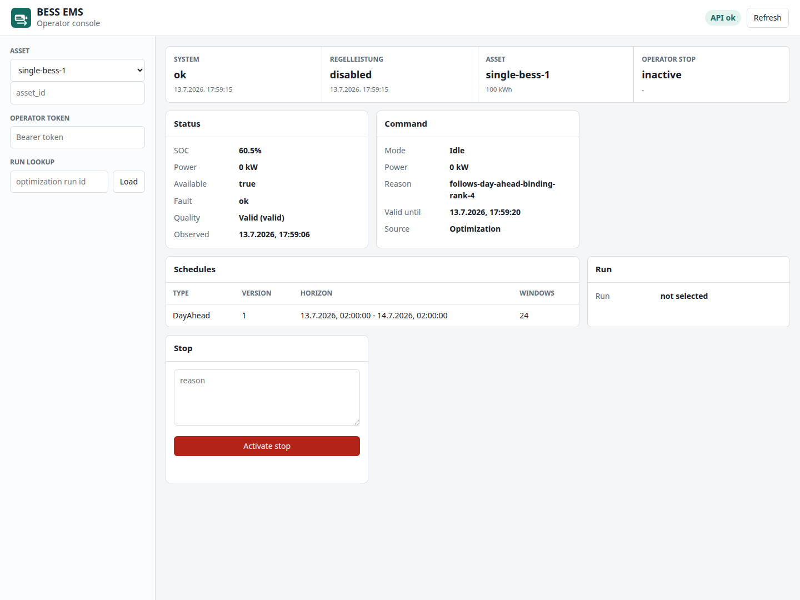
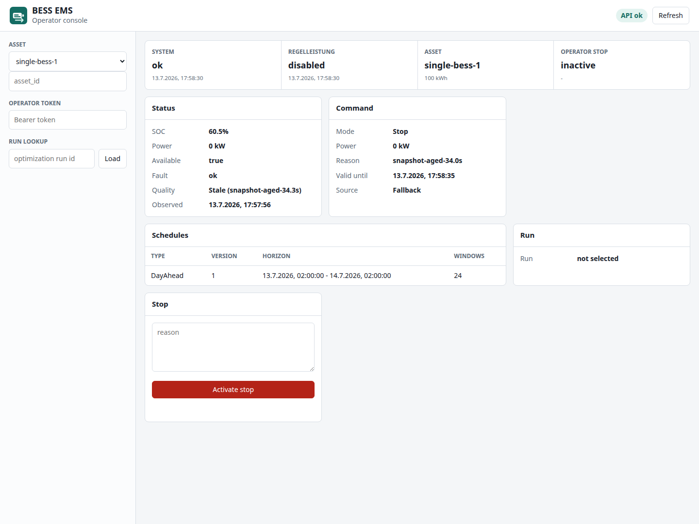

# Benutzerhandbuch: bess-ems

Version: 1.1
Software-Version: 2.2.1
Stand: 13.07.2026

## 1. Einleitung

### Zweck der Software

bess-ems ist das Energie-Management-System für Batteriespeicher (BESS):
Es empfängt Telemetrie aus dem Feld, optimiert Lade-/Entladefahrpläne
gegen Marktpreise und gibt sekündlich sichere Sollwerte an die Anlage.
Was das EMS fachlich tut, erklärt
[`bess-ems-function.md`](bess-ems-function.md).

### Zielgruppe

Dieses Handbuch richtet sich an **Operatoren** — Personen, die eine
laufende bess-ems-Instanz bedienen: Anlagen überwachen, Optimierungen
anstoßen, im Störfall eingreifen. Es setzt keine Programmierkenntnisse
voraus; die Beispiele nutzen die Kommandozeile (`curl`) und die
Operator-Oberfläche im Browser.

Nicht Gegenstand dieses Handbuchs: Installation und Deployment
(→ [`releasing.md`](releasing.md), Compose-/Helm-Artefakte unter
`deploy/`), Protokoll-Integration (→ [`opc-ua.md`](opc-ua.md),
[`sut-field-endpoint.md`](sut-field-endpoint.md)) und
Datenhaltung (→ [`persistence.md`](persistence.md)).

### Voraussetzungen

* Eine laufende bess-ems-Instanz (im Beispiel: der lokale
  Simulations-Stack, siehe Abschnitt 2).
* Für schreibende Aktionen (Stopp setzen, Optimierung anstoßen,
  Preisreihe importieren): Ihr **API-Token** mit der Rolle `operator`
  (vom Administrator; im lokalen Simulations-Stack ist
  `dev-operator-token` vorkonfiguriert).
* Die Adresse der Instanz (im Beispiel: `http://localhost:8080`).

> **Sicherheitshinweis:** Der lokale Simulations-Stack nutzt ein
> bekanntes Demo-Token und unverschlüsseltes MQTT — er ist eine reine
> Simulationsumgebung. Produktive Instanzen erhalten eigene Tokens und
> TLS (→ [`quality.md`](quality.md) §2.2.1).

## 2. Erste Schritte

### Den lokalen Simulations-Stack starten

Ausgangssituation: Sie haben das Repository ausgecheckt, Docker läuft.

1. Bauen Sie die beiden lokalen Images (der Stack lädt sie nicht aus
   einer Registry):

   ```bash
   make build simulator-build
   ```

2. Starten Sie den Stack:

   ```bash
   docker compose -f deploy/compose.yml up -d --wait
   ```

3. Prüfen Sie die Gesundheit der Instanz:

   ```bash
   curl -fsS http://localhost:8080/health
   ```

Ergebnis: HTTP 200. Der Stack enthält neben bess-ems einen
Feld-Simulator, einen MQTT-Broker (Mosquitto) und eine Datenbank; die
Regelzyklen laufen sofort an.

Hinweis: Antwortet `/health` mit **503**, läuft die Instanz, aber eine
kritische Komponente ist nicht gesund — die Antwort listet die
Komponenten einzeln auf (siehe Abschnitt 7).

### Die Operator-Oberfläche öffnen

Öffnen Sie im Browser:

```
http://localhost:8080/operator/
```



Die Oberfläche zeigt auf einer Seite:

* **Statusband** — System-Health, Regelleistung-Status, gewählte
  Anlage (mit Kapazität) und den Operator-Stop-Zustand.
* **Status** — aktuelle Telemetrie der Anlage (SoC, Leistung,
  Verfügbarkeit, Fault, Telemetrie-Qualität).
* **Command** — das zuletzt gesendete Kommando (Mode, Leistung,
  Begründung, Gültigkeit, Quelle).
* **Schedules** — die aktiven Fahrpläne (Typ, Version, Horizont,
  Fensteranzahl).
* **Run** — Detail-Ansicht eines Optimierungslaufs; geben Sie links
  unter **Run lookup** eine `run_id` ein und klicken Sie **Load**.
* **Stop** — Operator-Stop auslösen (einzige schreibende Aktion;
  benötigt Ihr Token im Feld **Operator token**).

Die Anlage wählen Sie links oben im Feld **Asset**; **Refresh** lädt
alle Ansichten neu. Optimierungen anstoßen und Preisreihen
importieren sind nicht Teil der Oberfläche — dafür nutzen Sie die
API (Abschnitt 3).

### Grundlegende Bedienung der API

Lesende Abfragen brauchen kein Token:

```bash
curl -fsS http://localhost:8080/assets
```

Ergebnis: die Liste der registrierten Anlagen, z. B. `single-bess-1`.

Schreibende Anfragen tragen Ihr Token als Bearer-Header
(`Authorization: Bearer <token>`) — Beispiele in Abschnitt 3. Alle
JSON-Felder verwenden durchgängig `snake_case`
(z. B. `asset_id`, `horizon_start`).

## 3. Aufgaben ausführen

### Anlagenzustand prüfen

#### Voraussetzung

Die Instanz läuft; Sie kennen die Anlagen-ID (Abschnitt 2, `/assets`).

#### Vorgehen

1. Rufen Sie den Status der Anlage ab:

   ```bash
   curl -fsS http://localhost:8080/battery/single-bess-1/status
   ```

2. Rufen Sie das zuletzt gesendete Kommando ab:

   ```bash
   curl -fsS http://localhost:8080/battery/single-bess-1/command/current
   ```

#### Ergebnis

Sie sehen Ladezustand (SoC), Leistung, Verfügbarkeit und das aktuelle
Sollwert-Kommando inklusive Quelle (`source`).

#### Hinweise

Die Kommando-Quelle zeigt, in welchem Modus die Anlage fährt:

| `source` | Bedeutung |
| -------- | --------- |
| `Optimization` | Normalbetrieb — der Regelzyklus folgt dem optimierten Fahrplan. |
| `Operator` | Ein Operator-Stop ist aktiv (nächste Aufgabe). |
| `Fallback` | Sicherheitsmodus (Safe-Stop) — Ursachen siehe Abschnitt 7. |

Anders als die übrigen JSON-Werte der API sind `source` und `mode`
in Großschreibung (`Optimization`, nicht `optimization`) — beachten
Sie das beim Filtern oder Vergleichen.

### Not-Stopp für eine Anlage setzen (Operator-Stop)

#### Voraussetzung

Token mit Rolle `operator`. Der Operator-Stop übersteuert jeden
Fahrplan: die Anlage erhält ab sofort 0-kW-Sollwerte.

#### Vorgehen

1. Setzen Sie den Stopp mit einer Begründung:

   ```bash
   curl -fsS -X POST \
     -H "Authorization: Bearer dev-operator-token" \
     -H "Content-Type: application/json" \
     -d '{"asset_id":"single-bess-1","reason":"Wartung Wechselrichter"}' \
     http://localhost:8080/operator/stop
   ```

2. Prüfen Sie den Stopp-Status der Anlage:

   ```bash
   curl -fsS "http://localhost:8080/operator/stops/current?assetId=single-bess-1"
   ```

#### Ergebnis

Die Antwort auf den Stopp nennt Anlage, Operator, Begründung und
Aktivierungszeit; die Statusabfrage zeigt den aktiven Stopp —
`stop: null` bedeutet, dass keiner aktiv ist. Jeder Stopp-Versuch —
auch abgelehnte — wird dauerhaft im Audit-Log protokolliert, mit der
Operator-Identität aus Ihrem Token.

#### Hinweise

* Alternativ über die Operator-Oberfläche (Abschnitt 2): Anlage
  wählen, Token in **Operator token** eintragen, Begründung in das
  Feld **reason**, dann **Activate stop** klicken.
* **Es gibt bewusst keinen „Stopp aufheben“-Endpoint.** Ein aktiver
  Stopp gilt bis zum Neustart der Instanz. Ein erneuter Stopp auf
  dieselbe Anlage ersetzt nur Begründung und Operator.
* Der Stopp wirkt auf die Sollwerte des EMS — er ersetzt **nicht** die
  Sicherheitsfunktionen der Anlage selbst (BMS, Not-Aus).

### Preisreihe importieren

#### Voraussetzung

Token mit Rolle `operator`. Marktpreise für den Zielhorizont liegen
vor (Zeitraster in Sekunden, ein Preis je Schritt).

#### Vorgehen

1. Importieren Sie die Reihe:

   ```bash
   curl -fsS -X POST \
     -H "Authorization: Bearer dev-operator-token" \
     -H "Content-Type: application/json" \
     -d '{
       "market_bid_area": "DE-LU",
       "product": "day_ahead",
       "price_kind": "energy",
       "unit": "EUR/MWh",
       "source": "manual-import",
       "horizon_start": "2026-07-14T00:00:00Z",
       "horizon_end": "2026-07-14T04:00:00Z",
       "time_step_seconds": 3600,
       "values": [78.1, 65.4, 59.9, 72.3]
     }' \
     http://localhost:8080/markets/price-series/import
   ```

#### Ergebnis

Die Antwort bestätigt Quelle (`source`) und Anzahl (`count`) der
importierten Preise. Optimierungen können die Reihe anschließend per
Referenz nutzen (nächste Aufgabe, Hinweise), statt Preise inline
mitzuschicken.

#### Hinweise

* Die Anzahl der Werte muss zum Horizont und Zeitraster passen (im
  Beispiel: 4 Stunden ÷ 3600 s = 4 Werte), sonst lehnt die API den
  Import mit HTTP 400 ab.
* `source` ist Ihr frei wählbares Herkunfts-Etikett — Optimierungen
  referenzieren die Reihe später über die Kombination
  `market_bid_area` + `product` + `price_kind` + `source`.

### Day-Ahead-Optimierung anstoßen

#### Voraussetzung

Token mit Rolle `operator`. Preise für den Horizont — entweder
importiert (vorige Aufgabe) oder inline im Aufruf.

#### Vorgehen

1. Starten Sie die Optimierung (Beispiel mit Inline-Preisen):

   ```bash
   curl -fsS -X POST \
     -H "Authorization: Bearer dev-operator-token" \
     -H "Content-Type: application/json" \
     -d '{
       "asset_id": "single-bess-1",
       "schedule_type": "day_ahead",
       "horizon_start": "2026-07-14T00:00:00Z",
       "horizon_end": "2026-07-14T04:00:00Z",
       "time_step_seconds": 3600,
       "prices_per_step": [78.1, 65.4, 59.9, 72.3],
       "price_unit": "EUR/MWh"
     }' \
     http://localhost:8080/markets/day-ahead/optimize
   ```

2. Die Antwort enthält `run_id` und `status`. Prüfen Sie den Lauf bei
   Bedarf später erneut:

   ```bash
   curl -fsS http://localhost:8080/optimization/runs/<run_id>
   ```

3. Sehen Sie den aktiven Fahrplan ein:

   ```bash
   curl -fsS "http://localhost:8080/markets/schedules/current?assetId=single-bess-1"
   ```

#### Ergebnis

Bei Erfolg meldet die Antwort `status` = `optimal` (oder `feasible`,
wenn der Solver eine gültige, aber nicht beweisbar optimale Lösung
fand) und in `produced_schedule_version` die Version des neuen
Fahrplans. Der Regelzyklus folgt ihm ab dem nächsten Takt.

#### Hinweise

* Statt `prices_per_step`/`price_unit` können Sie eine importierte
  Reihe referenzieren:

  ```json
  "price_series": {
    "market_bid_area": "DE-LU",
    "product": "day_ahead",
    "price_kind": "energy",
    "source": "manual-import"
  }
  ```

  Existiert die Referenz nicht, antwortet die API mit HTTP 404.
* Scheitert der Lauf, kommt trotzdem HTTP 200 — `status` nennt dann
  die Ursache (siehe Abschnitt 7); der bisherige Fahrplan bleibt
  unverändert aktiv.

### Intraday-Reoptimierung anstoßen

#### Voraussetzung

Token mit Rolle `operator`. Ein aktiver Fahrplan existiert; für den
Resthorizont liegen aktuelle Preise vor.

#### Vorgehen

1. Reoptimieren Sie den Resthorizont:

   ```bash
   curl -fsS -X POST \
     -H "Authorization: Bearer dev-operator-token" \
     -H "Content-Type: application/json" \
     -d '{
       "asset_id": "single-bess-1",
       "residual_start": "2026-07-14T02:00:00Z",
       "horizon_end": "2026-07-14T04:00:00Z",
       "time_step_seconds": 3600,
       "prices_per_step": [61.0, 84.5],
       "price_unit": "EUR/MWh"
     }' \
     http://localhost:8080/markets/intraday/reoptimize
   ```

#### Ergebnis

Der Fahrplan wird ab `residual_start` durch die neue Lösung ersetzt;
bereits vergangene Zeitfenster bleiben unangetastet. Prüfung wie bei
Day-Ahead über `run_id` und `schedules/current`.

#### Hinweise

`residual_start` muss auf eine Fenstergrenze des bestehenden Fahrplans
fallen; sonst endet der Lauf mit einem Fehlstatus
(`termination_reason` nennt die Ausrichtung als Ursache) und der
bestehende Fahrplan bleibt aktiv.

## 4. Einstellungen

Die Instanz wird vollständig über Umgebungsvariablen konfiguriert
(`Bess__…`-Schlüssel im Compose-/Helm-Deployment); Änderungen nimmt
Ihr Administrator vor. Für Operatoren am relevantesten:

| Einstellung | Wirkung |
| ----------- | ------- |
| `Bess__AssetConfigPath` | Welche Anlage(n) die Instanz führt (Anlagen-ID, Leistungs-/SoC-Grenzen). |
| `Bess__SnapshotMaxAge` | Frische-Fenster der Telemetrie (Standard 10 s) — ältere Daten lösen den Sicherheitsmodus aus. |
| `ApiTokens__Tokens__…` | Zugangs-Tokens (Token, Operator-Name, Rolle). |
| `Worker__CycleInterval` | Takt des Regelzyklus (Standard 1 s). |

Die Feld-Anbindung (MQTT/Modbus/OPC UA) ist in
[`sut-field-endpoint.md`](sut-field-endpoint.md) und
[`opc-ua.md`](opc-ua.md) beschrieben.

## 5. Rollen und Rechte

* **Lesende Abfragen** (Status, Fahrpläne, Optimierungsläufe,
  `/health`, `/metrics`) sind ohne Token abrufbar — die API geht davon
  aus, dass der Netzwerkzugang zur Instanz bereits beschränkt ist.
* **Schreibende Aktionen** (Operator-Stop, Preisreihen-Import,
  Optimierungen) erfordern ein Token mit der Rolle **`operator`**:
  ohne gültiges Token antwortet die API mit **401**, mit einem Token
  einer anderen Rolle mit **403**.
* Der Operator-Name aus Ihrem Token landet bei jeder schreibenden
  Aktion im Audit-Log — Sie können ihn nicht per Request-Body
  überschreiben.

## 6. Import und Export

* **Import:** Preisreihen über `POST /markets/price-series/import`
  (Abschnitt 3); Anlagen-Konfiguration als JSON-Datei über
  `Bess__AssetConfigPath` (Administrator).
* **Export/Monitoring:** Metriken im Prometheus-Format unter
  `GET /metrics`; Optimierungsläufe und Fahrpläne über die
  Abfrage-Endpunkte aus Abschnitt 3.

## 7. Fehlerbehebung

### Fehler: Anlage folgt dem Fahrplan nicht (Quelle `Fallback` oder `Operator`)

#### Ursache

Der Regelzyklus geht in den Sicherheitsmodus (Safe-Stop), wenn er
keine verwertbare Telemetrie hat, die Anlage nicht verfügbar ist oder
ein Operator-Stop gilt. In der Operator-Oberfläche erkennen Sie den
Zustand an Quelle `Fallback` und der Telemetrie-Qualität:



Das Log der Instanz nennt die Ursache je Zyklus (Safe-Stop-Zeilen
tragen `"EventId":1702`):

| Log-Signal | Bedeutung |
| ---------- | --------- |
| `decision=no-snapshot` | Es kam **nie** Telemetrie an (Feld-Anbindung, Anlagen-ID prüfen). |
| `decision=snapshot-unusable` + `reason=snapshot-aged-<Sekunden>s` (z. B. `snapshot-aged-12.3s`) | Telemetrie ist **zu alt** (Feld sendet zu selten oder Verbindung gestört). |
| `decision=asset-unavailable` | Die Anlage meldet sich selbst als nicht verfügbar (z. B. aktiver Fault). |
| `decision=operator-stop` | Ein Operator-Stop ist aktiv (Abschnitt 3). |
| `decision=dispatch-invalid` | Die Fahrplan-Auflösung lieferte für den aktuellen Zeitpunkt keinen gültigen Sollwert (`reason` nennt das Detail) — Fahrplan-Abdeckung prüfen, ggf. neu optimieren. |

Daneben gibt es seltene `decision`-Werte für Konfigurations- und
Rechenfehler (`asset-not-registered`, `dispatch-target-not-finite`,
`kernel-non-finite-result`) — kontaktieren Sie in diesen Fällen Ihr
Betriebsteam.

#### Lösung

1. Prüfen Sie den Stopp-Status
   (`/operator/stops/current?assetId=<assetId>`).
2. Prüfen Sie den Anlagenstatus (`/battery/<assetId>/status`):
   Verfügbarkeit, Zeitstempel der letzten Daten.
3. Prüfen Sie die Feld-Anbindung nach dem Rezept in
   [`sut-field-endpoint.md`](sut-field-endpoint.md) §5.
4. Nach Behebung kehrt der Zyklus selbstständig in den Normalbetrieb
   zurück (Log: `Control cycle emitted command`, `"EventId":1701`).

### Fehler: HTTP 401 oder 403 bei schreibenden Aufrufen

#### Ursache

**401:** fehlender oder unbekannter `Authorization`-Header.
**403:** das Token ist gültig, hat aber nicht die Rolle `operator`.

#### Lösung

1. Header-Form prüfen: `Authorization: Bearer <token>`.
2. Token und Rolle mit Ihrem Administrator abgleichen.

### Fehler: `/health` liefert 503

#### Ursache

Eine kritische Komponente (z. B. die Datenbank) ist nicht gesund; die
Instanz selbst läuft.

#### Lösung

1. Antwort-Body lesen — er listet den Zustand je Komponente.
2. Komponente prüfen/starten (lokal: `docker compose ps`).

### Fehler: Optimierung liefert keinen neuen Fahrplan

#### Ursache

Der Lauf endete mit einem Fehlstatus. `status` in der Antwort (bzw.
unter `/optimization/runs/<run_id>`) benennt die Klasse,
`termination_reason` das Detail:

| `status` | Bedeutung |
| -------- | --------- |
| `infeasible` | Kein Fahrplan erfüllt die Anlagengrenzen (Horizont, SoC-/Leistungsgrenzen prüfen). |
| `unbounded` | Das Optimierungsproblem ist unbeschränkt — deutet auf fehlerhafte Preis- oder Grenzwert-Eingaben. |
| `time_limit` / `iteration_limit` | Der Solver hat sein Rechenbudget erreicht. |
| `failed` | Solver- oder Eingabefehler — `termination_reason` nennt das Detail. |

Formfehler (fehlende Felder, unbekannter `schedule_type`, Anzahl der
Preise passt nicht zum Raster) weist die API dagegen sofort mit
HTTP 400 ab; eine unbekannte Anlage mit HTTP 404.

#### Lösung

1. `termination_reason` lesen und die Eingabe korrigieren (Horizont,
   Preise, Zeitraster).
2. Lauf erneut anstoßen — der letzte gültige Fahrplan bleibt bis
   dahin aktiv.

## 8. FAQ

**Wie hebe ich einen Operator-Stop wieder auf?**
Gar nicht per API — das ist eine bewusste Sicherheitsentscheidung. Der
Stopp gilt bis zum Neustart der Instanz durch den Administrator.

**Woran erkenne ich, dass alles normal läuft?**
`/health` = 200, Kommando-Quelle `Optimization`, im Log zyklisch
`Control cycle emitted command` (`"EventId":1701`).

**Kann ich mehrere Anlagen bedienen?**
Ja — `/assets` listet alle registrierten Anlagen; alle Aufgaben aus
Abschnitt 3 arbeiten je `asset_id`.

**Verliert die Anlage bei einem EMS-Ausfall die Kontrolle?**
Jedes Kommando trägt eine Gültigkeitsgrenze (`valid_until`); ohne
frische Kommandos fällt die Anlage auf ihr eigenes sicheres Verhalten
zurück. Das EMS ersetzt keine Anlagen-Sicherheitstechnik.

## 9. Glossar

| Begriff | Bedeutung |
| ------- | --------- |
| Anlage / Asset | Ein Batteriespeicher-System, identifiziert über die `asset_id`. |
| SoC / SoH | Ladezustand (State of Charge) / Gesundheitszustand (State of Health) in Prozent. |
| Fahrplan (Schedule) | Zeitreihe von Leistungs-Sollwerten aus einer Optimierung, versioniert gespeichert. |
| Day-Ahead / Intraday | Optimierung für den Folgetag bzw. Nach-Optimierung des Resthorizonts. |
| Optimierungslauf (`run_id`) | Ein einzelner Solver-Durchlauf mit Status und Ergebnis, abfragbar unter `/optimization/runs/<run_id>`. |
| Regelzyklus | Der Sekunden-Takt, in dem das EMS Telemetrie bewertet und einen Sollwert sendet. |
| Safe-Stop / Sicherheitsmodus | Das EMS sendet 0-kW-Sollwerte, weil kein sicherer Betrieb ableitbar ist. |
| Operator-Stop | Von Ihnen manuell gesetzter Not-Stopp einer Anlage (bis Neustart). |
| Frische-Fenster | Maximales Alter der Telemetrie (`Bess__SnapshotMaxAge`, Standard 10 s). |
| Telemetrie | Messdaten der Anlage (SoC, Leistung, Spannung, Temperatur, Verfügbarkeit). |

## 10. Support und Kontakt

Wenden Sie sich an das Betriebsteam Ihrer Installation. Halten Sie
bereit: Software-Version (Release-Tag des Deployments), betroffene
`asset_id`, Zeitstempel und die relevanten Log-Zeilen (Abschnitt 7).

## 11. Änderungshistorie

| Handbuch-Version | Software-Version | Datum | Änderung |
| ---------------- | ---------------- | ----- | -------- |
| 1.1 | 2.2.1 | 13.07.2026 | Screenshots der Operator-Oberfläche ergänzt; Oberflächen-Beschreibung vervollständigt (Statusband, Fahrplan-Tabelle, Run-Lookup); Stop-Aufgabe um den Oberflächen-Weg ergänzt. Erfordert 2.2.1: erst dort liefert der Compose-Stack `/operator/` aus. |
| 1.0 | 2.2.0 | 13.07.2026 | Erstausgabe (Operator-Aufgaben, Fehlerbehebung, FAQ, Glossar). |
