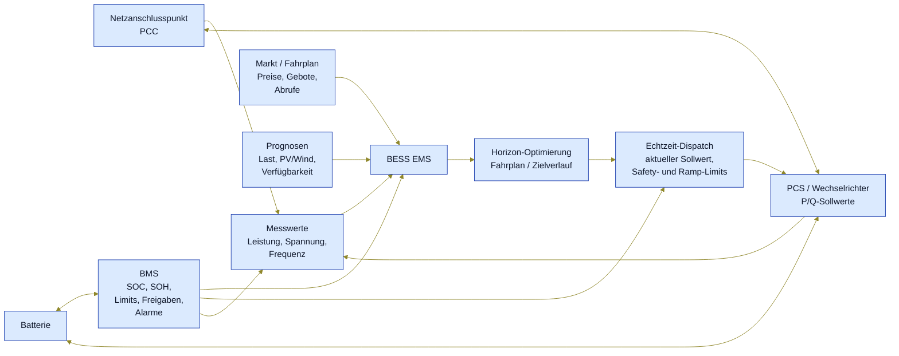
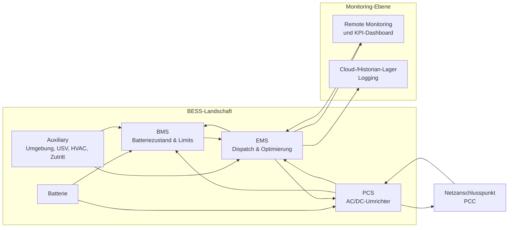
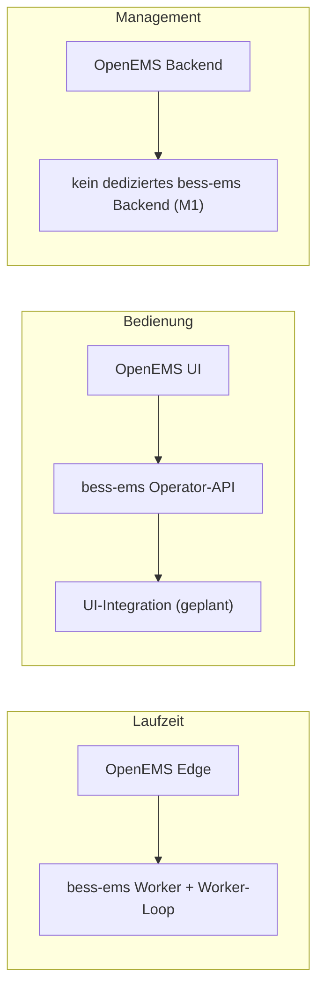
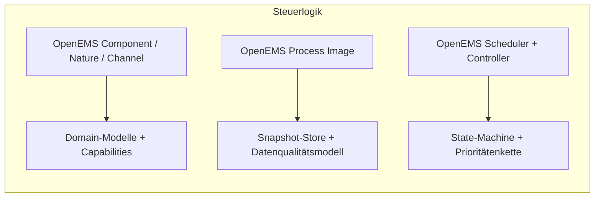
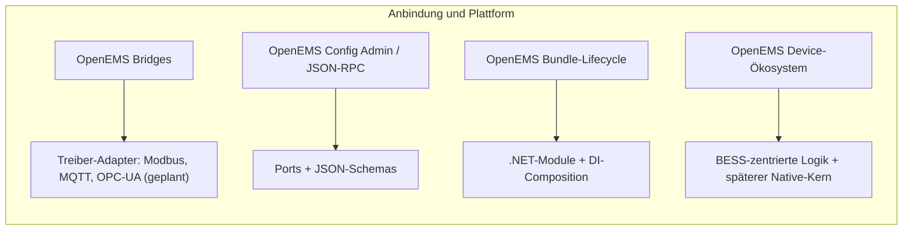
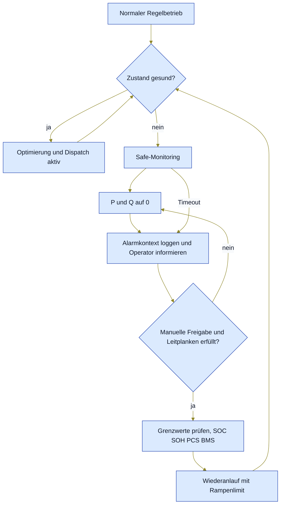

# Funktion eines BESS EMS

## Zweck

Dieses Dokument illustriert die Rolle eines Battery Energy Storage System
Energy Management System (`BESS EMS`). Es beschreibt aus Anwendersicht,
welche Informationen ein EMS verarbeitet, welche Entscheidungen es trifft
und welche Sollwerte es an Batterie- und Leistungselektronik weitergibt.

Das EMS ist dabei nicht die Batterie selbst und auch nicht das
Sicherheits-BMS. Es ist die koordinierende Steuerungs- und
Optimierungsschicht zwischen Markt, Netz, lokaler Anlage und
Batteriesystem.

---

## 1. Gesamtbild



Die EMS-Funktion lässt sich in sechs wiederkehrende Schritte gliedern:

1. **Messen:** aktuelle Anlagen-, Batterie- und Netzwerte erfassen.
2. **Bewerten:** technische Grenzen, Alarme, SOC/SOH und Datenqualität
   prüfen.
3. **Optimieren:** Fahrpläne oder Zielverläufe über einen Horizont
   bestimmen. Dieser Schritt läuft nicht zwingend in jedem
   Regelzyklus, sondern kann zeit-, ereignis- oder operatorgetrieben
   aktualisieren.
4. **Dispatchen:** den aktuell gültigen Sollwert auswählen, priorisieren
   und durch Safety- und Ramp-Limits begrenzen.
5. **Ausgeben:** konkrete Wirk- und Blindleistungssollwerte an den PCS
   beziehungsweise den Feldadapter senden.
6. **Nachregeln:** Istwerte beobachten und im nächsten Zyklus
   korrigieren.

---

## 2. Eingaben

| Quelle             | Typische Daten                                               | Zweck im EMS                                              |
| ------------------ | ------------------------------------------------------------ | --------------------------------------------------------- |
| Netzanschlusspunkt | Wirkleistung, Blindleistung, Spannung, Frequenz              | Rückmeldung, ob der Zielwert am PCC erreicht wird         |
| Batterie/BMS       | SOC, SOH, Zell-/Rack-Limits, Temperaturen, Freigaben, Alarme | Schutzgrenzen und verfügbare Lade-/Entladeleistung        |
| PCS/Wechselrichter | aktueller P/Q-Wert, Status, Fehler, Verfügbarkeit            | Umsetzung und Plausibilisierung des Dispatchs             |
| Markt/Fahrplan     | Day-Ahead-Fahrplan, Intraday-Änderungen, Abrufe              | wirtschaftliche oder vertragliche Zielvorgabe             |
| Prognosen          | Last, Erzeugung, Preise, Verfügbarkeit                       | vorausschauende Optimierung statt reiner Momentanregelung |
| Operator           | Betriebsmodus, Sperren, manuelle Limits, Freigaben           | Prioritäten und betriebliche Leitplanken                  |

### 2.1 Rollen der Kernkomponenten

- **BMS (Battery Management System)**  
  Batterieüberwachung/-steuerung, Alarmierung bei abnormalen Zuständen, und
  Bereitstellung von SOC, SOH, Limits sowie Freigaben für das EMS.
- **Auxiliary System**  
  Überwacht Umgebungs- und Sicherheitszustände wie Temperatur,
  unautorisierten Zugriff, USV-Zustand und HVAC und meldet Auffälligkeiten.
- **PCS (Power Conversion System)**  
  Setzt EMS-Kommandos um, steuert Lade- und Entladeleistung und
  übernimmt die AC/DC-Umsetzung.
- **EMS (Energy Management System)**  
  Steuert den Leistungsfluss, überwacht den SoC im Betrieb, unterstützt
  Remote Monitoring und KPI-Management sowie lokales und cloud-basiertes
  Logging und Management.



## 3. Architekturvergleich und Referenz

### 3.1 Beispiel für EMS-Software: [OpenEMS](https://github.com/OpenEMS/openems)

- **OpenEMS** (Open Source): Modularer Stack mit **Edge**, **Backend** und
  **UI**, der auf Gerätemodelle, Zeitreihenbetrieb und Steuerlogik setzt.
- Typisch passend für das hier beschriebene EMS-Konzept, weil das Projekt
  ausdrücklich ein Energy Management System für Speicher, Last- und
  Erzeugungsintegration beschreibt.
- Die Architektur ist stark auf
  integrationsnahe Anbindung ausgelegt (z. B. Gateway-/Bridge-Module
  wie Modbus, MQTT, REST), und mehrere Batterie-/Inverter-Treiber sind
  als fertige Komponenten im Repository angelegt.
- Lizenz- und Betriebsmodell: Open Source (u. a. **AGPL-3.0 / EPL-2.0**),
  dadurch hoher Integrations- und Erweiterungsgrad, aber mit
  entsprechenden Produkt-/Compliance-Anforderungen an eigene Deployments.
- Für ISV/Hersteller und proprietäre Produktisierung ist der **MIT-Ansatz von bess-ems** in der Regel die passendere Wahl, da er weniger Lizenzrestriktionen für eigene Betriebslogik und IP-Vermarktung mit sich bringt.

### 3.2 OpenEMS vs. bess-ems (M1-Stand)

  | Bereich                       | OpenEMS (openems)                                                                                                                           | bess-ems                                                                                                                                                      |
  | ----------------------------- | ------------------------------------------------------------------------------------------------------------------------------------------- | ------------------------------------------------------------------------------------------------------------------------------------------------------------- |
  | Ausrichtung                   | „IoT-Stack“ für Site-level EMS mit Edge + Backend + UI; starke Geräte-/Asset-Abstraktion und Controller-Ökosystem.                          | Speziell auf BESS fokussiert, mit expliziter Architektur für Marktlogik, Regelung, Optimierung und Sicherheitsfallbacks.                                      |
  | Kerntechnologie               | Java + OSGi/Bündel, modulare Bundle-Architektur.                                                                                            | C#/.NET 10, optionale C/C++-Native-Kerne (P/Invoke), Docker-first.                                                                                            |
  | Architekturprinzip            | Input-Process-Output-Zyklus, Prozessbild-Konsistenz (Process Image), Scheduler + Controller.                                                | Getrennter Regelkreispfad mit Optimierung -> State-Machine/Limiter -> Command, hexagonal/dreischichtig dokumentiert, klarer Safety-First-Flow.                |
  | Marktfunktionalität           | Schwerpunkt auf flexiblem EMS-/Gerätemanagement; Dokumentation hebt breite Device-/Protokollunterstützung und PLC-ähnliche Regelung hervor. | Spezifisch auf Day-Ahead/Intraday/Regelleistung ausgelegt mit Marktpriorisierung sowie Constraint-Hierarchie laut Lastenheft.                                 |
  | Sicherheit & Fallback         | Fokussiert auf deterministische Komponentenlogik, mit möglicher OSGi-bedingter Asynchronität/Latenz.                                        | Explizit priorisierte Sicherheitskette (Emergency Stop, Datengüte, Datenalter, sichere Defaults), inkl. definiertem Fallback bei ungültigem Snapshot.         |
  | Geräte-/Kommunikationsschicht | Sehr starke „Device as Component“-Abstraktion; breite Anbindung über Bridges/Controller-Konzept (u. a. Modbus/TCP in Beispielen).           | Konkrete Adapterwege für Modbus TCP, MQTT (MVP), OPC-UA als nächster Ausbauschritt; einheitliche Adapter-Ports und interne Modelle.                           |
  | Beobachtbarkeit               | UI + Backend für Echtzeitansicht, Historie und Aggregation vorhanden.                                                                       | API-first mit Health/Status/Command/Fahrplan, persistenter Historie und Audit-Events; Monitoring (Métriken/OTel) als geplante/teilweise umgesetzte Ergänzung. |
  | Reifegrad                     | Sehr reifer Bestand (viele Releases, breite Community/Instanzen).                                                                           | Aktuell M1, Kernlogik/Tests vorhanden, aber nicht „full production“ (laut eigenem Repo).                                                                      |
  | Lizenz                        | OpenEMS-Edge: EPL-2.0, OpenEMS-UI: AGPL-3.0.                                                                                                | MIT.                                                                                                                                                          |

Die OpenEMS-Lizenzangaben gelten je Modul; bei produktiven Installationen sollte die genaue Lizenz je eingesetzter Komponente verifiziert werden.

#### Fazit

- bess-ems gewinnt, wenn ihr schnell einen marktgetriebenen, BESS-zentrierten Kontrollpfad mit expliziter Safety-Priorisierung und klarer Trennung von Markt- vs. Echtzeitlogik braucht.
- OpenEMS gewinnt, wenn ihr lieber ein etabliertes, vollständiges Ökosystem mit Edge/Backend/UI und breitem Geräte-Controller-Portfolio sofort nutzen wollt, inkl. Community-Wartung.
- Kurzregel: Wenn maximale Freiheit für Produktisierung, proprietäre Erweiterungen und IP-Schließung entscheidend sind, passt **bess-ems (MIT)** besonders gut.

### 3.3 1:1-Mapping (OpenEMS ↔ bess-ems)







| OpenEMS-Baustein         | bess-ems-Mapping                                   | Aktueller Stand                                           |
| ------------------------ | -------------------------------------------------- | --------------------------------------------------------- |
| Edge                     | Worker + Worker-Loop / Realtime-Orchestrierung     | Entspricht dem regelungsnahen Kern am Standort            |
| UI                       | Operator-API (MVP), UI-Integration geplant         | OpenEMS hat bereits ein produktives Echtzeit-Frontend     |
| Backend                  | Kein dediziertes Backend-Modul (M1)                | Aggregation/Multi-Standort liegt noch aus                 |
| Component/Nature/Channel | Domain-Modelle + Capabilities                      | Gute Entsprechung inkl. Vorzeichenkonvention              |
| Process Image            | Snapshot-Store + Datenqualitätsmodell              | Explizit auf Datengüte und sichere Defaults ausgelegt     |
| Scheduler + Controller   | State-Machine + Prioritätenkette + Limiter-Routing | Unterschiedlicher Schichtaufbau, klarer Safety-First-Flow |
| Bridges                  | Treiber-Adapter (Modbus, MQTT; OPC-UA geplant)     | Adapter-/Port-Trennung bereits klar strukturiert          |
| Konfiguration            | Konfigurationsgetriebene Ports + JSON-Schemas      | Aktuell stärker Datei/Code-zentriert als UI-zentriert     |
| Lifecycle                | .NET + DI-Composition (Hexagonaler Ansatz)         | Modularität gegeben, aber andere Plattform                |
| Device-/ESS-Ökosystem    | BESS-zentrierte Logik + späterer Native-Kern       | Fokussiert auf BESS und Marktpfade                        |


---

## 4. Entscheidungen

Das EMS entscheidet nicht nur, **ob** geladen oder entladen wird, sondern
auch **wie stark**, **wie lange** und **unter welchen Grenzen**.

Typische Entscheidungslogik:

- Das EMS verarbeitet kontinuierlich eintreffende Datenströme (Messwerte,
  Prognosen, Markt- und Statusinformationen), um Lade- und Entladezyklen
  laufend zu optimieren.

- Bei niedrigen Preisen oder lokaler Überschusserzeugung laden.
- Bei hohen Preisen oder Lastspitzen entladen.
- Einen Fahrplan am Netzanschlusspunkt einhalten.
- Reserve für Regelenergie oder Notfallbetrieb freihalten.
- Rampen, SOC-Fenster, Temperaturgrenzen und Anlagenverfügbarkeit
  respektieren.
- Bei schlechter Datenqualität oder kritischen Alarmen in einen
  sicheren Zustand wechseln.

Die Optimierung ist dabei zweigeteilt:

- **Horizon-Optimierung:** erzeugt oder aktualisiert Fahrpläne und
  Zielverläufe für einen Zeitraum, ohne direkt Feldgeräte anzusteuern.
- **Echtzeit-Dispatch:** wählt im Regelzyklus den gerade gültigen
  Sollwert, kombiniert ihn mit aktiven Prioritäten und begrenzt ihn
  durch technische Schutz- und Rampenregeln.

Das Ergebnis ist immer ein Abgleich aus Ziel und Randbedingungen:

```text
Zielwert = wirtschaftliches / netzdienliches Ziel
         begrenzt durch Batterie-Limits
         begrenzt durch Wechselrichter-Limits
         begrenzt durch Sicherheits- und Betriebsregeln
```

---

## 5. Ausgaben

Das Ergebnis des EMS ist ein begrenzter Dispatch an die nachgelagerten
technischen Systeme. Das BMS liefert dafür Schutzgrenzen, Freigaben und
Batteriezustand; P/Q-Sollwerte werden an PCS beziehungsweise
Feldadapter ausgegeben.

| Zielsystem              | Ausgabe                            | Bedeutung                                  |
| ----------------------- | ---------------------------------- | ------------------------------------------ |
| PCS / Wechselrichter    | `P`-Sollwert                       | Laden oder Entladen der Batterie           |
| PCS / Wechselrichter    | `Q`-Sollwert                       | Blindleistungsbereitstellung, falls aktiv  |
| Persistenz / Monitoring | Telemetrie, Commands, Audit-Events | Nachvollziehbarkeit und Betriebsauswertung |
| Operator-Oberfläche     | Status, Fehler, aktueller Modus    | Transparenz für Leitwarte und Betrieb      |

Zur Vermeidung von Mehrdeutigkeit gilt im weiteren Verlauf die interne
BESS-EMS-Konvention dieses Dokuments:

- `+P` bedeutet Entladen bzw. Einspeisen an das Netz
- `-P` bedeutet Laden bzw. Bezug in die Batterie
- `0 kW` bedeutet kein aktiver Lade- oder Entladebefehl
- `+Q` bzw. `-Q` folgen der je nach Netzanschlusspunkt vereinbarten
  Blindleistungsdefinition

Abweichende Gerätekonventionen werden in Protokolladaptern umgesetzt,
damit Fahrpläne, Optimierung, Limiter, Commands und Persistenz intern
dieselbe Konvention verwenden.

---

## 6. Typische Betriebsarten

| Betriebsart                | Ziel                                                        |
| -------------------------- | ----------------------------------------------------------- |
| Fahrplanbetrieb            | Ein vorgegebener Leistungsfahrplan wird am PCC nachgefahren |
| Peak Shaving               | Lastspitzen werden durch Entladen begrenzt                  |
| Eigenverbrauchsoptimierung | Lokale Erzeugung wird gespeichert und später lokal genutzt  |
| Arbitrage                  | Laden bei niedrigen Preisen, Entladen bei hohen Preisen     |
| Frequenzstützung           | Leistung wird zur Stabilisierung der Netzfrequenz angepasst |
| Reservehaltung             | Ein SOC-Korridor wird für spätere Abrufe freigehalten       |
| Manueller Betrieb          | Operator gibt Modus oder Sollwert innerhalb der Limits vor  |

---

## 7. Sicherheitsprinzip

Das EMS optimiert den Betrieb, ersetzt aber keine Schutzfunktionen. BMS,
PCS und Schutztechnik behalten ihre eigenen harten Grenzen. Das EMS muss
diese Grenzen kennen und respektieren, aber die letzte Schutzinstanz
liegt in den technischen Schutzsystemen.

Praktisch bedeutet das:

- Keine Sollwerte außerhalb freigegebener Batterie- oder PCS-Limits.
- Kein Normalbetrieb bei kritischen Alarmen.
- Begrenzung von Rampen und Sprüngen.
- Konkreter Notfall-/Fallbackmodus bei Störungen (z. B. Datenqualitäts-
  degradiert, Kommunikationsausfall, kritischer Alarm): sichere
  Leistungs-Sollwerte ausgeben (`P=0`, `Q=0`) und auf manuellen
  Freigabestatus warten.
- Nachvollziehbare Command- und Audit-Historie.
- Definiertes Verhalten bei Kommunikations- oder Datenqualitätsfehlern.

## 7.1 Notfall- und Wiederanlaufablauf (vereinfacht)



## 7.2 Typische Auslöser für den sicheren Zustand

| Ereignis (Beispiel)                               | Typische Auswirkung                        | Reaktion im Safe-Mode                                                |
| ------------------------------------------------- | ------------------------------------------ | -------------------------------------------------------------------- |
| Kritischer BMS-Alarm                              | Batterie- oder Zellschutz greift           | `P=0`, `Q=0`, keine aktiven Dispatch-Befehle                         |
| PCS-Fehler, Freigabe weg                          | Leistungsabgabe kann nicht sicher erfolgen | Leistung auf 0, Anlagenzustand sichern                               |
| Kommunikationsverlust EMS↔BMS/PCS                 | Zustand/limits nicht verlässlich           | `P=0`, `Q=0` halten, Monitoring alarmieren und Operator informieren. |
| Unplausible Messung (z. B. Sprünge, Timeout)      | Optimierung wird unzuverlässig             | Fallback beibehalten, Operator informieren                           |
| Datenqualität unter Grenzwert                     | Risiko falscher Dispatch-Berechnung        | Kein automatischer Re-Enable bis Freigabe                            |
| Scharfes Netzereignis (Frequenz-/Spannungsabwurf) | Netzvorgaben / Schutzlogik erzwingen       | Lokale Grenzwerte respektieren, ggf. 0er Sollwerte                   |

Ein Rückkehrkriterium ist immer: **kritische Bedingungen beseitigt**,  
**manuelle Freigabe liegt vor** und **Grenzprüfungen (SOC/SOH, Temperatur,
BMS/PCS-Limits) sind bestanden**.

---

## 8. Kurzform

```text
Messen -> Bewerten -> Optimieren -> Dispatchen -> Ausgeben -> Nachregeln
```

Ein BESS EMS ist damit die Schicht, die aus technischen Messwerten,
Batteriezustand, Markt-/Fahrplanvorgaben und Betriebsregeln konkrete,
sichere und nachvollziehbare Leistungsbefehle für das Batteriesystem
ableitet.
