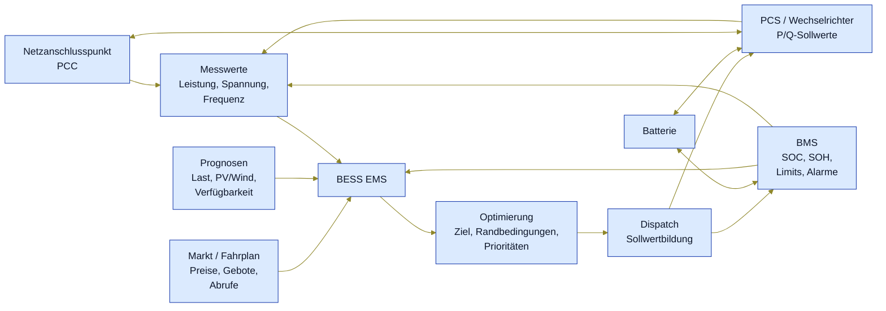

# Funktion eines BESS EMS

## Zweck

Dieses Dokument illustriert die Rolle eines Battery Energy Storage System
Energy Management System (`BESS EMS`). Es beschreibt aus Anwendersicht,
welche Informationen ein EMS verarbeitet, welche Entscheidungen es trifft
und welche Sollwerte es an Batterie- und Leistungselektronik weitergibt.

Das EMS ist dabei nicht die Batterie selbst und auch nicht das
Sicherheits-BMS. Es ist die koordinierende Steuerungs- und
Optimierungsschicht zwischen Markt, Netz, lokaler Anlage und
Batteriesystem.

---

## 1. Gesamtbild



Der Regelkreis besteht aus fünf wiederkehrenden Schritten:

1. **Messen:** aktuelle Anlagen-, Batterie- und Netzwerte erfassen.
2. **Bewerten:** technische Grenzen, Alarme, SOC/SOH und Datenqualität
   prüfen.
3. **Optimieren:** bestes Verhalten für Fahrplan, Markt, Netz oder
   Eigenverbrauch bestimmen.
4. **Dispatchen:** konkrete Wirk- und Blindleistungssollwerte an PCS
   und BMS ausgeben.
5. **Nachregeln:** Istwerte beobachten und im nächsten Zyklus
   korrigieren.

---

## 2. Eingaben

| Quelle             | Typische Daten                                     | Zweck im EMS                                              |
| ------------------ | -------------------------------------------------- | --------------------------------------------------------- |
| Netzanschlusspunkt | Wirkleistung, Blindleistung, Spannung, Frequenz    | Rückmeldung, ob der Zielwert am PCC erreicht wird         |
| Batterie/BMS       | SOC, SOH, Zell-/Rack-Limits, Temperaturen, Alarme  | Schutzgrenzen und verfügbare Lade-/Entladeleistung        |
| PCS/Wechselrichter | aktueller P/Q-Wert, Status, Fehler, Verfügbarkeit  | Umsetzung und Plausibilisierung des Dispatchs             |
| Markt/Fahrplan     | Day-Ahead-Fahrplan, Intraday-Änderungen, Abrufe    | wirtschaftliche oder vertragliche Zielvorgabe             |
| Prognosen          | Last, Erzeugung, Preise, Verfügbarkeit             | vorausschauende Optimierung statt reiner Momentanregelung |
| Operator           | Betriebsmodus, Sperren, manuelle Limits, Freigaben | Prioritäten und betriebliche Leitplanken                  |

---

## 3. Entscheidungen

Das EMS entscheidet nicht nur, **ob** geladen oder entladen wird, sondern
auch **wie stark**, **wie lange** und **unter welchen Grenzen**.

Typische Entscheidungslogik:

- Bei niedrigen Preisen oder lokaler Überschusserzeugung laden.
- Bei hohen Preisen oder Lastspitzen entladen.
- Einen Fahrplan am Netzanschlusspunkt einhalten.
- Reserve für Regelenergie oder Notfallbetrieb freihalten.
- Rampen, SOC-Fenster, Temperaturgrenzen und Anlagenverfügbarkeit
  respektieren.
- Bei schlechter Datenqualität oder kritischen Alarmen in einen
  sicheren Zustand wechseln.

Die Optimierung ist damit immer ein Abgleich aus Ziel und
Randbedingungen:

```text
Zielwert = wirtschaftliches / netzdienliches Ziel
         begrenzt durch Batterie-Limits
         begrenzt durch Wechselrichter-Limits
         begrenzt durch Sicherheits- und Betriebsregeln
```

---

## 4. Ausgaben

Das Ergebnis des EMS ist ein Dispatch an die nachgelagerten technischen
Systeme.

| Zielsystem              | Ausgabe                                       | Bedeutung                                         |
| ----------------------- | --------------------------------------------- | ------------------------------------------------- |
| PCS / Wechselrichter    | `P`-Sollwert                                  | Laden oder Entladen der Batterie                  |
| PCS / Wechselrichter    | `Q`-Sollwert                                  | Blindleistungsbereitstellung, falls aktiv         |
| BMS                     | Betriebsfreigaben, Limits, Modusinformationen | Abstimmung mit Batterieschutz und Batteriezustand |
| Persistenz / Monitoring | Telemetrie, Commands, Audit-Events            | Nachvollziehbarkeit und Betriebsauswertung        |
| Operator-Oberfläche     | Status, Fehler, aktueller Modus               | Transparenz für Leitwarte und Betrieb             |

Die Vorzeichenkonvention muss in der Anlage eindeutig festgelegt sein.
In vielen EMS-Kontexten bedeutet positive Wirkleistung am
Netzanschlusspunkt Einspeisung, negative Wirkleistung Bezug. Entscheidend
ist, dass EMS, PCS, Messung und Reporting dieselbe Konvention verwenden.

---

## 5. Typische Betriebsarten

| Betriebsart                | Ziel                                                        |
| -------------------------- | ----------------------------------------------------------- |
| Fahrplanbetrieb            | Ein vorgegebener Leistungsfahrplan wird am PCC nachgefahren |
| Peak Shaving               | Lastspitzen werden durch Entladen begrenzt                  |
| Eigenverbrauchsoptimierung | Lokale Erzeugung wird gespeichert und später lokal genutzt  |
| Arbitrage                  | Laden bei niedrigen Preisen, Entladen bei hohen Preisen     |
| Frequenzstützung           | Leistung wird zur Stabilisierung der Netzfrequenz angepasst |
| Reservehaltung             | Ein SOC-Korridor wird für spätere Abrufe freigehalten       |
| Manueller Betrieb          | Operator gibt Modus oder Sollwert innerhalb der Limits vor  |

---

## 6. Sicherheitsprinzip

Das EMS optimiert den Betrieb, ersetzt aber keine Schutzfunktionen. BMS,
PCS und Schutztechnik behalten ihre eigenen harten Grenzen. Das EMS muss
diese Grenzen kennen und respektieren, aber die letzte Schutzinstanz
liegt in den technischen Schutzsystemen.

Praktisch bedeutet das:

- Keine Sollwerte außerhalb freigegebener Batterie- oder PCS-Limits.
- Kein Normalbetrieb bei kritischen Alarmen.
- Begrenzung von Rampen und Sprüngen.
- Nachvollziehbare Command- und Audit-Historie.
- Definiertes Verhalten bei Kommunikations- oder Datenqualitätsfehlern.

---

## 7. Kurzform

```text
Messen -> Bewerten -> Optimieren -> Dispatchen -> Überwachen -> Nachregeln
```

Ein BESS EMS ist damit die Schicht, die aus technischen Messwerten,
Batteriezustand, Markt-/Fahrplanvorgaben und Betriebsregeln konkrete,
sichere und nachvollziehbare Leistungsbefehle für das Batteriesystem
ableitet.
